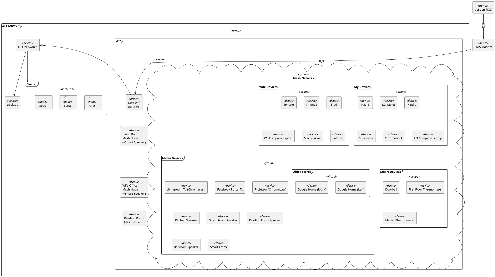

# Documentation @211

## Network Topology

```plantuml
@startuml
' skinparam rectangle {
'     RoundCorner<<device>> 25
'     BackgroundColor<<device>> PaleGreen
'     BorderColor<<device>> DarkGreen
'     BackgroundColor<<group>> Wheat
'     BorderColor<<group>> Sienna
'     BackgroundColor<<homeLab>> LightSkyBlue
'     BorderColor<<homeLab>> DarkBlue
' }

rectangle "Verizon FiOS" as fios <<device>>
rectangle "FiOS Modem" as modem <<device>>

frame "211 Network" <<group>> {
    rectangle "TP-Link Switch" as tplink <<device>>

    rectangle "Desktop" as battlestation <<device>>

    frame "Cluster" as cluster <<homeLab>> {
        frame "Aries" <<node>> {
            ' rectangle "w1" <<device>>
            ' rectangle "w2" <<device>>
            ' rectangle "m1" <<device>>
        }
        frame "Luna" <<node>> {
            ' rectangle "w3" <<device>>
            ' rectangle "w4" <<device>>
            ' rectangle "m2" <<device>>
        }
        frame "Zeus" <<node>> {
            ' rectangle "w5" <<device>>
            ' rectangle "w6" <<device>>
            ' rectangle "m3" <<device>>
        }
    }

    tplink --> cluster
    tplink --> battlestation

    frame "Wifi" as wifi {
        rectangle "Nest Wifi\n(Router)" as wifi0 <<device>>
        rectangle "Living Room\nMesh Node\n(+Smart Speaker)" as wifi1 <<device>>
        rectangle "Wife Office\nMesh Node\n(+Smart Speaker)" as wifi2 <<device>>
        rectangle "Reading Room\nMesh Node" as wifi3 <<device>>
        ' rectangle "Wireless Mesh Node" as wifi4 <<device>>

        cloud "Mesh Network" as network <<group>> {

            frame "My Devices" <<group>> {
                rectangle "Pixel 3" <<device>>
                rectangle "LG Tablet" <<device>>
                rectangle "Kindle" <<device>>
                rectangle "Supernote" <<device>>
                rectangle "Chromebook" <<device>>
                rectangle "LN Company Laptop" <<device>>
                ' rectangle "Raspberry Pi" <<device>>
            }

            frame "Wife Devices" <<group>> {
                rectangle "iPhone" <<device>>
                rectangle "iPhone2" <<device>>
                rectangle "iPad" <<device>>
                rectangle "WF Company Laptop" <<device>>
                rectangle "Macbook Air" <<device>>
                rectangle "Peloton" <<device>>
            }

            frame "Smart Devices" <<group>> {
                rectangle "Doorbell" <<device>>
                rectangle "First Floor Thermometer" <<device>>
                rectangle "Master Thermometer" <<device>>
            }

            frame "Media Devices" <<group>> {
                rectangle "Livingroom TV (Chromecast)" <<device>>
                rectangle "Facebook Portal TV" <<device>>
                rectangle "Projector (Chromecast)" <<device>>
                rectangle "Kitchen Speaker" <<device>>
                rectangle "Guest Room Speaker" <<device>>
                rectangle "Reading Room Speaker" <<device>>
                rectangle "Bedroom Speaker" <<device>>
                frame "Office Stereo" <<virtual>> {
                    rectangle "Google Home (Left)" <<device>>
                    rectangle "Google Home (Right)" <<device>>
                }
                rectangle "Smart Frame" <<device>>

                ' rectangle "Blink Camera 1" <<device>>
                ' rectangle "Blink Camera 2" <<device>>
                ' rectangle "Blink Camera 3" <<device>>
                ' rectangle "Blink Indoor Camera" <<device>>
            }
        }
    }

    fios -do(0)-> modem
    modem -do(0)-> wifi0
    wifi0 .. wifi1
    wifi1 .. wifi2
    wifi2 .. wifi3

    wifi0 -up-> tplink
    wifi .. network : creates
}

@enduml

```
